# Foodie Eyes - System Diagrams

This document contains detailed Mermaid diagrams for the Foodie Eyes application, including process flow and use case diagrams.

---

## 1. Process Flow Diagram - Search & Discovery Flow

This diagram shows the complete process flow from user query to displaying results.


---

## 2. Use Case Diagram - System Actors & Use Cases

This diagram shows all actors and their interactions with the system.

```mermaid
graph TB
    User[👤 User<br/>Guest/Registered]
    System[🍔 Foodie Eyes System]
    Groq[🤖 Groq AI]
    Serper[🗺️ Serper API]
    Firebase[🔥 Firebase]
    Maps[📍 Google Maps]
    
    %% User Use Cases
    User -->|UC1: Set Location| System
    User -->|UC2: Search Food Places| System
    User -->|UC3: Use Voice Input| System
    User -->|UC4: Apply Filters| System
    User -->|UC5: View Place Details| System
    User -->|UC6: Bookmark Places| System
    User -->|UC7: View Bookmarks| System
    User -->|UC8: View Search History| System
    User -->|UC9: Share Places| System
    User -->|UC10: Sign In/Out| System
    User -->|UC11: Select Mood Cards| System
    User -->|UC12: Use Location Autocomplete| System
    
    %% System Internal Processes
    System -->|Validate Query| Groq
    System -->|Optimize Query| Groq
    System -->|Detect Cuisine| Groq
    System -->|Analyze Places| Groq
    System -->|Search Places| Serper
    System -->|Get Place Details| Serper
    System -->|Authenticate User| Firebase
    System -->|Save Bookmarks| Firebase
    System -->|Save History| Firebase
    System -->|Get User Data| Firebase
    System -->|Reverse Geocode| Maps
    System -->|Location Autocomplete| Maps
    
    %% Use Case Details
    UC1[UC1: Set Location<br/>- Manual Input<br/>- GPS Location<br/>- Autocomplete<br/>- Save Preference]
    UC2[UC2: Search Food Places<br/>- Text Query<br/>- Voice Query<br/>- Mood Selection<br/>- Filter Application]
    UC3[UC3: Use Voice Input<br/>- Start/Stop Recording<br/>- Speech to Text<br/>- Permission Handling]
    UC4[UC4: Apply Filters<br/>- Dietary Preferences<br/>- Budget Range<br/>- Allergen Avoidance]
    UC5[UC5: View Place Details<br/>- Full Information<br/>- Reviews & Ratings<br/>- Contact Details<br/>- Map Location]
    UC6[UC6: Bookmark Places<br/>- Add/Remove<br/>- Requires Auth<br/>- Persist to Cloud]
    UC7[UC7: View Bookmarks<br/>- List Saved Places<br/>- Quick Access<br/>- Remove Bookmarks]
    UC8[UC8: View Search History<br/>- Past Searches<br/>- Quick Re-search]
    UC9[UC9: Share Places<br/>- Social Media<br/>- Copy Link<br/>- WhatsApp/Telegram]
    UC10[UC10: Sign In/Out<br/>- Google Sign-In<br/>- Email/Password<br/>- Session Management]
    UC11[UC11: Select Mood Cards<br/>- Quick Search<br/>- Pre-defined Moods]
    UC12[UC12: Use Location Autocomplete<br/>- Real-time Suggestions<br/>- Address Selection]
    
    System -.->|Implements| UC1
    System -.->|Implements| UC2
    System -.->|Implements| UC3
    System -.->|Implements| UC4
    System -.->|Implements| UC5
    System -.->|Implements| UC6
    System -.->|Implements| UC7
    System -.->|Implements| UC8
    System -.->|Implements| UC9
    System -.->|Implements| UC10
    System -.->|Implements| UC11
    System -.->|Implements| UC12
    
    style User fill:#e1f5ff
    style System fill:#d4edda
    style Groq fill:#fff9e6
    style Serper fill:#fff9e6
    style Firebase fill:#fff9e6
    style Maps fill:#fff9e6
```



---

## 3. Detailed Search Process Flow

This diagram shows the detailed search algorithm with scoring and ranking.


---

## 4. Component Interaction Flow

This diagram shows how React components interact with each other.


---

## 5. Data Flow Diagram

This diagram shows how data flows through the system.

```mermaid
flowchart LR
    subgraph "User Input Layer"
        TextInput[Text Input]
        VoiceInput[Voice Input]
        MoodCards[Mood Cards]
        Filters[Filters]
    end
    
    subgraph "Frontend Processing"
        SearchHero[SearchHero Component]
        QueryBuilder[Query Builder<br/>Contextual Query]
    end
    
    subgraph "API Layer"
        AgentAPI[/api/agent Route]
        QueryExtractor[Base Query Extractor]
    end
    
    subgraph "AI Processing"
        GroqValidate[Groq: Validate Intent]
        GroqOptimize[Groq: Optimize Query]
        GroqCuisine[Groq: Detect Cuisine]
        GroqAnalyze[Groq: Analyze Places]
    end
    
    subgraph "External APIs"
        SerperSearch[Serper: Search Places]
        SerperDetails[Serper: Get Details]
        MapsGeocode[Maps: Reverse Geocode]
    end
    
    subgraph "Data Processing"
        Scoring[Smart Scoring]
        Ranking[Ranking Algorithm]
        Filtering[Result Filtering]
    end
    
    subgraph "Storage"
        FirebaseAuth[Firebase: Auth]
        FirestoreBookmarks[Firestore: Bookmarks]
        FirestoreHistory[Firestore: History]
        LocalStorage[LocalStorage: Location]
    end
    
    subgraph "Output Layer"
        Results[Results Display]
        DetailModal[Detail Modal]
        Bookmarks[Bookmarks View]
        History[History View]
    end
    
    TextInput --> SearchHero
    VoiceInput --> SearchHero
    MoodCards --> SearchHero
    Filters --> SearchHero
    
    SearchHero --> QueryBuilder
    QueryBuilder --> AgentAPI
    
    AgentAPI --> QueryExtractor
    QueryExtractor --> GroqValidate
    GroqValidate --> GroqOptimize
    GroqOptimize --> GroqCuisine
    
    GroqCuisine --> SerperSearch
    SerperSearch --> SerperDetails
    SerperDetails --> Scoring
    Scoring --> Ranking
    Ranking --> Filtering
    Filtering --> GroqAnalyze
    GroqAnalyze --> Results
    
    Results --> DetailModal
    DetailModal --> FirebaseAuth
    FirebaseAuth --> FirestoreBookmarks
    FirestoreBookmarks --> Bookmarks
    
    SearchHero --> FirestoreHistory
    FirestoreHistory --> History
    
    SearchHero --> LocalStorage
    MapsGeocode --> LocalStorage
    
    style TextInput fill:#e1f5ff
    style VoiceInput fill:#e1f5ff
    style MoodCards fill:#e1f5ff
    style Filters fill:#e1f5ff
    style Results fill:#d4edda
    style DetailModal fill:#d4edda
    style Bookmarks fill:#d4edda
    style History fill:#d4edda
    style GroqValidate fill:#fff9e6
    style GroqOptimize fill:#fff9e6
    style GroqCuisine fill:#fff9e6
    style GroqAnalyze fill:#fff9e6
    style SerperSearch fill:#fff9e6
    style SerperDetails fill:#fff9e6
    style Scoring fill:#e7f3ff
    style Ranking fill:#e7f3ff
```

---

## 6. System Architecture Diagram

This diagram shows the overall system architecture.

```mermaid
graph TB
    subgraph "Client Layer"
        Browser[Web Browser<br/>Next.js App]
        Components[React Components]
        Hooks[Custom Hooks]
        Context[React Context]
    end
    
    subgraph "API Layer"
        NextAPI[Next.js API Routes]
        AgentRoute[/api/agent]
    end
    
    subgraph "AI Services"
        GroqService[Groq AI Service<br/>- Query Refinement<br/>- Cuisine Detection<br/>- Place Analysis]
    end
    
    subgraph "External Services"
        SerperAPI[Serper API<br/>Google Maps Places]
        MapsAPI[Google Maps API<br/>Geocoding]
        FirebaseService[Firebase<br/>- Authentication<br/>- Firestore]
    end
    
    subgraph "Data Processing"
        ScoringEngine[Scoring Engine<br/>- Cuisine Matching<br/>- Place Type Matching<br/>- Term Matching]
        RankingEngine[Ranking Engine<br/>- Score-based Sorting]
    end
    
    Browser --> Components
    Components --> Hooks
    Hooks --> Context
    Components --> NextAPI
    
    NextAPI --> AgentRoute
    AgentRoute --> GroqService
    AgentRoute --> SerperAPI
    AgentRoute --> ScoringEngine
    ScoringEngine --> RankingEngine
    RankingEngine --> AgentRoute
    
    Components --> FirebaseService
    Components --> MapsAPI
    
    GroqService -.->|API Calls| GroqService
    SerperAPI -.->|API Calls| SerperAPI
    FirebaseService -.->|API Calls| FirebaseService
    MapsAPI -.->|API Calls| MapsAPI
    
    style Browser fill:#e1f5ff
    style Components fill:#d4edda
    style AgentRoute fill:#fff9e6
    style GroqService fill:#fff9e6
    style SerperAPI fill:#fff9e6
    style FirebaseService fill:#fff9e6
    style ScoringEngine fill:#e7f3ff
    style RankingEngine fill:#e7f3ff
```

---

## How to Use These Diagrams

1. **Process Flow Diagram**: Use this to understand the complete search flow from user input to results display.

2. **Use Case Diagram**: Use this to understand all features and user interactions in the system.

3. **Detailed Search Process Flow**: Use this to understand the search algorithm, scoring, and ranking logic.

4. **Component Interaction Flow**: Use this to understand how React components communicate and interact.

5. **Data Flow Diagram**: Use this to understand how data moves through the system.

6. **System Architecture Diagram**: Use this to understand the overall system structure and technology stack.

### Rendering the Diagrams

You can render these Mermaid diagrams in:
- **GitHub**: Mermaid diagrams render automatically in `.md` files
- **VS Code**: Install "Markdown Preview Mermaid Support" extension
- **Online**: Use [Mermaid Live Editor](https://mermaid.live)
- **Documentation Sites**: Most modern documentation platforms support Mermaid

### Customization

Feel free to modify these diagrams to match your specific needs or add more details as the system evolves.
